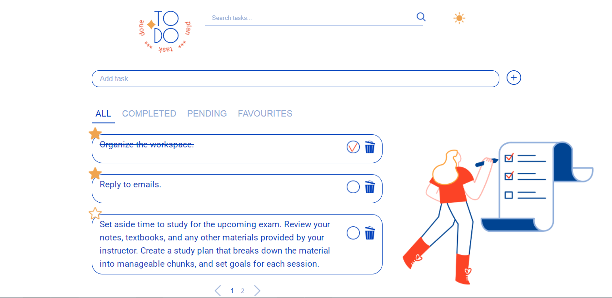
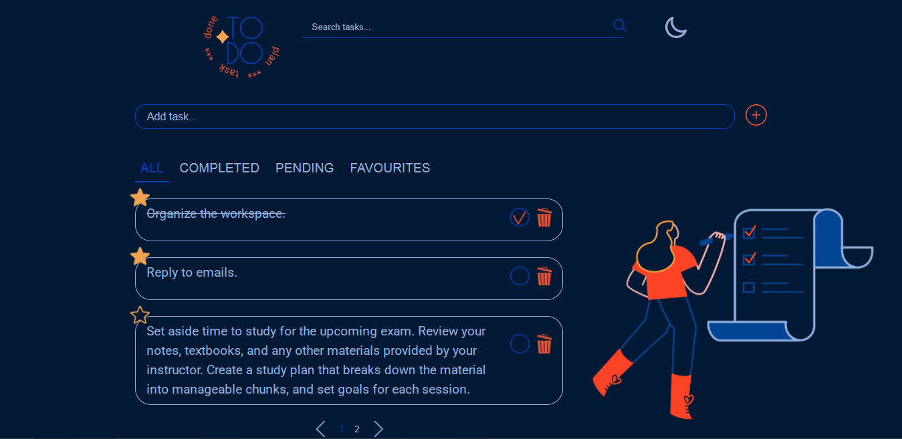
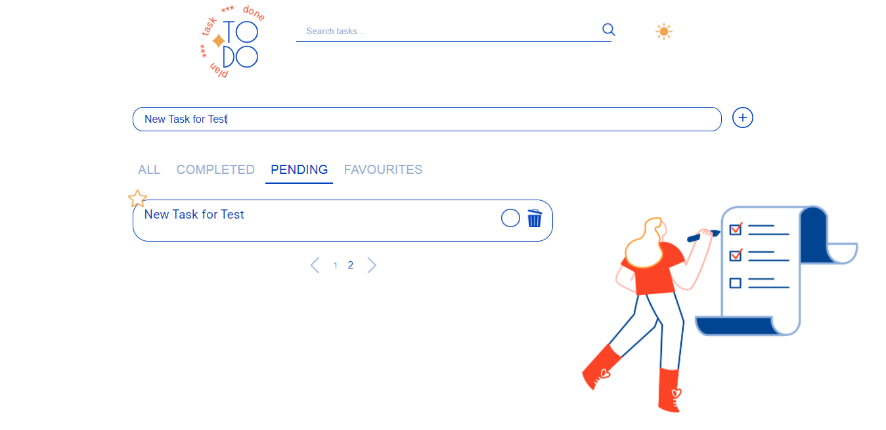
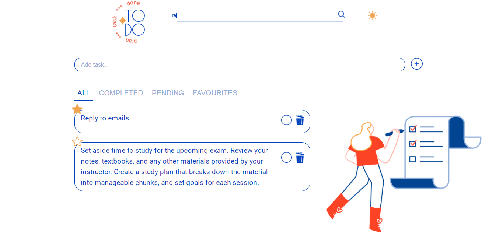

# TodoList - Frontend 🚀

A **TodoList** app where users can add, remove, change task statuses, and mark tasks as favorites. 🌟  
The project is built with **Vite**, **React**, **TypeScript**, and **RTK Query**.  
ESLint and Prettier are used to ensure code quality and consistency.

# Local Backend Server 🌐

This project relies on a local server to simulate a RESTful API. **Before using the frontend application, you must first download and run this local server** to handle the data.
You can find the backend repository here:
👉 [TODOlist Local Server](https://github.com/silvervelvet/TODOlist-LocalServer)

## Deployment

The app is deployed on GitHub Pages. You can visit the live version of the project at:
🌟💻

## Features ✨

- **Add, remove, and update tasks** 📝
- **Mark tasks as favorites** 💖
- **Switch between light/dark mode** 🌞🌙 using Context API for dynamic content and styles.
- **Search functionality** 🔍 for tasks with **debounce** (using Lodash) for better performance.

## Screenshots

## Tech Stack 💻

- **React** (v18.x)
- **TypeScript**
- **Vite** (for fast builds)
- **RTK Query** (for API management)
- **Redux Toolkit** (for state management)
- **Lodash** (for utility functions like debounce)
- **ESLint** & **Prettier** (for code quality)
- **Context API** (for theme switching)
